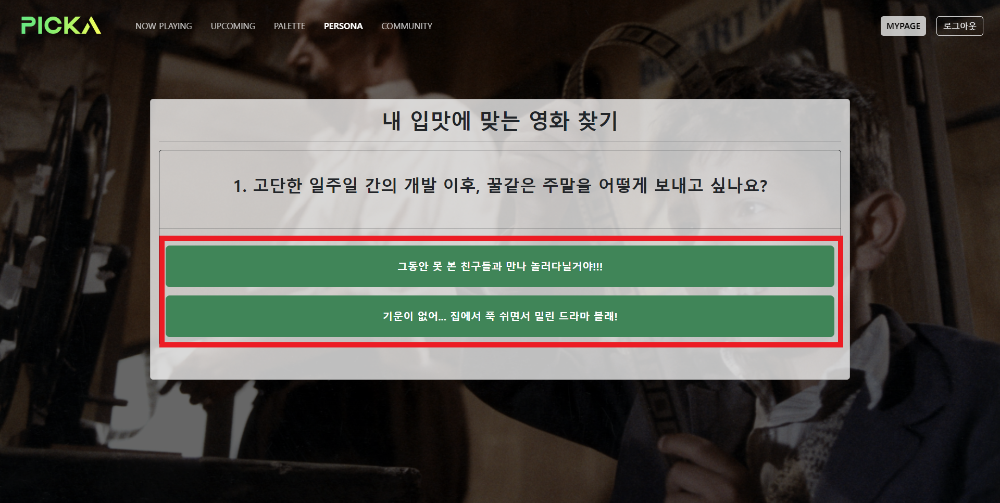

# PICKA - Final Project

[TOC]

---

## 1. 개요

> ### PICKA

#### 영화 추천 프로그램인 '피카'는 현재 상영작들과 개봉 예정작들을 중점으로, 

#### 사용자들의 **영화 관람 계획에 도움을 주는 서비스**입니다.

1. 피카는 **'현재 상영작 중 인기순위 상위 10개 영화'**를 사용자에게 보여주며, 사용자가 **'접속한 위치 근처의 상영관 정보'**를 알려줍니다. 
2. 피카는 **'개봉 예정작 중 인기순위 상위 10개 영화'** 사용자에게 보여줍니다.
3. 피카는 **'역대 인기영화들'** 중 사용자가 고른 **'본인만의 색'**에 맞는 영화들을 추전합니다.
4. 피카는 사용자의 **'성격테스트'** 결과에 맞는 영화들을 추천합니다.


> ### 서비스 명 / 로고 / 아이덴티티 컬러

#### 서비스명

- **PICKA** :  **"Pick a movie"**의 의미로, 사용자의 입맛에 맞게 영화를 고르고 사용자의 선택에 따른 추천 서비스임을 나타냅니다.

#### 아이덴티티 컬러 🌿

- **Neon Green** 
  - 최신영화를 기반으로 하는 서비스 특성을 드러내고자 싱그러운 초록과 영화의 빛을 나타내는 네온컬러를 아이덴티티 칼라로 두었습니다.
  - 더불어 기존 붉은 색이 많이 쓰이는 OTT 서비스들의 이미지에서 벗어나고자 차별점을 두었습니다. 


> ### Tool 🛠

#### ERD 

- Draw.io

#### UI / UX 기획 

- Figma

#### 프로젝트 일정관리 및 진행상황 기록

- Notion

#### 서비스 개발 프레임워크

- Django + JavaScript


---

## 2. 모델링

> ### ERD


- **Genre / UpcomingMovie / NowplayingMovie / Video**
  - TMDB 서비스의 API 사용
- **User / Review / Comment**
  - 프로젝트 내에서 구현


---

## 3. Backend (기능 설명과 구조)

> ### 관리자 

#### ADMIN PAGE

- 사용된 데이터

  - movies 애플리케이션의 NowPlayingMovie와 UpcomingMovie, Genre 모델 데이터
  - community 애플리케이션의 Review와 Comment 모델 데이터
  - accounts 애플리케이션의 User 모델 데이터

  


---

> ### 영화정보

#### NOW PLAYING

- **사용된 데이터**
  
  - MDB API 에서 제공하는 무비 세션 중 now playing에서 받아온 현재 상영작 정보들 중 인기도(popurality) 기준 TOP 10 영화
  
- **보여주는 정보 및 기능들**
  
  - **영화의 세부정보**
  
    - 제목, 장르, 개봉일, 평점, 줄거리 등
  
  - **예고편 유튜브영상**
  
    1. TMDB에서 현재 상영작과 비디오 API 세션을 각각 받아서 서로 연결을 통해 해당 영화들의 youtube 영상 key를 받아옴
    2. 그 뒤에 iframe 태그를 사용하여 그 태그 내에 youtube 영상 url를 넣는 방식으로 구현
  
  - **위치 기반 근처 영화관 소개**
  
    
  
    1. **JavaScript를 활용하여 사용자의 위치를 수집한다. 이 `Geolocation API`로 사용자가 위치한 위도와 경도 값을 수집한다.**
  
       - 이 때, 사용자는 이 기능을 위해서 위치정보 수집에 동의를 해야한다.
  
    2. **`1.`에서 수집한 위치 정보 값만으로는 사용자의 주소를 도출할 수 없으므로 카카오맵 API를 사용한다.** 
  
       이 과정에서 반환된 주소로 시,군,구 주소지를 도출해내는데 반환된 주소를 전부 사용하면 너무 세부적인 위치까지 검색하므로 효율성이 떨어지기 때문에 적당한 주소지 단위로 끊어 계산한다.
  
    3. **`2.`에서 얻어낸 사용자의 주소지와 영화 이름을 조합한 구글 검색 결과를 각 영화 정보화면에 연결한다.**
  
    4. **`3.`에서 연결한 버튼을 클릭하면 위치 기반 상영관 정보를 보여준다.**


#### UPCOMING

- **사용된 데이터**
  - MDB API 에서 제공하는 무비 세션 중 upcoming에서 받아온 현재 상영작 정보들 중 인기도(popurality) 기준 TOP 10 영화
- **보여주는 정보 및 기능들**
  - **영화의 세부정보**
    - 제목, 장르, 개봉일, 평점, 줄거리 등
  - **예고편 유튜브영상**
    1. **TMDB에서 현재 상영작과 비디오 API 세션을 각각 받아서 서로 연결을 통해 해당 영화들의 youtube 영상 key를 받아온다.**
    2. **그 뒤에 iframe 태그를 사용하여 그 태그 내에 youtube 영상 url를 넣는 방식으로 구현한다.**


---

> ### 추천 알고리즘

#### PALLETE

**팔레트 기능은 사용자가 다양한 색이 들어있는 사진에서 특정 색을 고르면,** 

**그 색상과 가장 비슷한 포스터를 가진 영화를 추천해주는 퍼스널 컬러 추천알고리즘입니다.**


1. **먼저 TMDB API의 Popular 세션에서 다수의 영화 정보를 수집한다.**

   - 영화가 많을수록 추천 알고리즘의 정확도가 높아지기 때문에 현재상영작 또는 개봉예정작이 아닌 인기작 세션에서 다수의 페이지 정보를 받는다.
   - 이 때, 필요한 정보만 받아 효율을 높이기 위해 받아오는 정보는 영화 제목과 포스터 경로이다.

2. **`OpenCV`라는 라이브러리를 사용해 이미지를 분석한다.**

   - OpenCV 라이브러리는 컴퓨터에게 있어 우리의 눈과 같은 역할을 한다. 우리가 눈으로 보고 이미지의 색상을 파악하는 것과 같이 컴퓨터에게 색상을 파악시켜주는 라이브러리이다.
   - 이 과정을 통해 포스터 내부의 모든 픽셀의 RGB값의 평균을 도출하고 이를 각각의 영화정보에 추가한다.

3. **영화정보에 들어간 RGB 값과 사용자가 선택한 RGB 값을 비교하여 가장 오차가 적은 영화 3가지를 사용자에게 추천해준다.**

   - 이 때, 두 RGB 값을 비교하는 수식은 다음과 같다.

     ```
     O = (R1 - R2)^2 + (G1 - G2)^2 + (B1 - B2)^2
     ```

     이 수식으로 계산한 후 O(오차)값이 가장 적은 포스터를 보여주게 된다.

     제곱을 하는 이유는 알고리즘의 정확도를 높이기 위함이다.

     만일 사용자가 고른 R / G / B 값과의 차이가 각각 1 / 1 / 1 인 포스터와 0 / 0 / 3 인 포스터가 있다고 가정하면, 실제 육안으로 봤을 때 전자는 차이가 적어 비슷하게 느껴지지만 후자는 다른 색상으로 보이게 된다.

     그러나 제곱을 하지 않은 상황에서 두 포스터의 오차값은 모두 '3'으로 동일하다.

     이 때, 각 RGB 차에 제곱을 하게 된다면 두 포스터의 오차는 각각 3 과 9로 벌어지게 된다. 즉 알고리즘의 정확성을 높일 수 있게 되는 것이다.


#### PERSONA


1. **TMDB API의 Now_playging 세션과 Genre 세션을 통해 영화 정보를 수집하고 이를 연결한다.**

2. **이후 7개 문항으로 이루어진 심리 테스트를 통해 사용자의 성격을 파악한다.** 

   - 질문이 많을수록 정확도가 높아지겠지만, 너무 많은 문항으로 이루어진 심리테스트는 사용자에게 피로를 유발할 수 있으므로 적절한 수의 문항으로 UX를 고려하였다.

   - 질문 1, 2, 3 에 따라 장르는 `ㄱ`리스트(9) / `ㄴ`리스트(9) 로 나뉨.
     - 질문 1, 2, 3 중에서 A 답변이 더 많으면 `ㄱ`,  B 답변이 더 많으면 `ㄴ`.
   - 질문 4, 5 에 따라 ㄱ 장르리스트 는 `ㄱ-ㄱ`리스트(3) / `ㄱ-ㄴ`리스트(3) / `ㄱ-ㄷ`(3) 로 나뉨 (`ㄴ`리스트도 마찬가지)
     - 질문 4, 5 중에서 A 답변이 0개면 `ㄱ-ㄱ`, 1개면 `ㄱ-ㄴ`, 2개면 `ㄱ-ㄷ`.
   - 질문 6, 7 에 따라 `ㄱ-ㄱ` 장르리스트 는 `ㄱ-ㄱ-ㄱ` 장르 / `ㄱ-ㄱ-ㄴ`장르 /` ㄱ-ㄱ-ㄷ`장르 로 나뉨 (나머지 리스트들도 마찬가지)
     - 질문 6, 7 중에서 A 답변이 0개면 `ㄱ-ㄱ-ㄱ`, 1개면 `ㄱ-ㄱ-ㄴ`, 2개면 `ㄱ-ㄱ-ㄷ`.

3. **심리테스트 결과를 기반으로 분류된 장르들에 비슷한 성격을 지닌 동물을 매핑하여 사용자에게 보여준다.**

   이 때 보여지는 결과는 다음과 같이 미리 유형화 된 데이터를 기반으로 한다. 

   | 장르       | 결과지             |
   | ---------- | ------------------ |
   | 모험       | 활발한 고양이      |
   | 판타지     | 꿈꾸는 용          |
   | 애니메이션 | 귀여운 토끼        |
   | 드라마     | 눈물 많은 사슴     |
   | 공포       | 울부짓는 까마귀    |
   | 액션       | 날렵한 호랑이      |
   | 코미디     | 재밌는 원숭이      |
   | 역사       | 생각하는 티라노    |
   | 서부       | 황야의 야생마      |
   | 스릴러     | 소름돋은 생쥐      |
   | 범죄       | 뻔뻔한 뻐꾸기      |
   | 다큐멘터리 | 호기심 많은 강아지 |
   | SF         | 공상하는 돌고래    |
   | 미스터리   | 수수께끼의 여우    |
   | 음악       | 청아한 꾀꼬리      |
   | 로맨스     | 사랑스러운 늑대    |
   | 가족       | 푸근한 코끼리      |
   | 전쟁       | 용감한 독수리      |

4. **해당 장르를 가진 영화들 중에 인기도 기준 상위 3개의 영화를 사용자에게 보여준다.**


> ### 커뮤니티

#### COMMUNITY

- **기능들**
  1. 작성된 게시글 리스트 조회하기
  2. 새로운 게시글 작성과 본인이 작성한 글 수정 및 삭제하기
  3. 작성된 게시글 상세 페이지 조회하기
  4. 댓글 달기와 본인이 작성한 댓글 삭제하기
  5. 본인 글을 제외한 작성된 게시글에 좋아요/좋아요 취소 누르기

#### MYPAGE

- **기능들**
  1. 본인이 작성한 게시글 조회하기 (게시글 클릭시 해당 게시글 상세페이지로 이동)
  2. 본인이 작성한 댓글 조회하기 (게시글 클릭시 해당 게시글 상세페이지로 이동)
  3. 개인정보 수정
  4. 비밀번호 변경
  5. 회원 탈퇴하기


---

## 4. Frontend (UI / UX 고려에 따른 페이지 구성)

> ### 영화정보

#### NOW PLAYING


- 현재 상영작 중 상위 열개의 영화를 캐루젤의 형태로 보여주며 각 캐루젤 화면에는 영화 하나의 정보들이 표시된다.

1. **네비게이션바**: 모든 페이지 상단에 고정되어 있으며, 각 기능들을 넘나들 수 있다. PICKA 로고를 누르면 메인페이지로 이동한다. 현재 위치한 페이지의 이름이 활성화된다.

2. **근처 상영관 보러가기**: 현재 서비스 사용자 위치 주변의 해당 영화 상영관 검색 결과를 보여준다.

   - 예시 (사용자 위치: 강동구 / 영화: 닥터 스트레인지: 대혼돈의 멀티버스)

     

3. **유튜브 예고편:** 해당 영화의 메인 예고편을 보여준다.


#### UPCOMING


- NOW PLAYING과 유사한 UI로 구성된다.


> ### 추천 알고리즘

#### PALLETE

- **로딩화면**

  

  - 해당 추천 기능은 다수의 포스터에 대해 RGB 평균값을 도출해야 하므로 로딩시간이 비교적 길다.
  - 때문에 사용자는 무슨 일이 벌어지는지 모르고 기다려야 하는 상황이 발생한다.
  - 이를 방지하기 위해, 데이터가 준비되는 동안 로딩화면을 띄워 UX를 향상시킨다.


- **팔레트 화면**

  

  1. **가운데 있는 알록달록한 사진에 커서를 올리면 포인터가 십자모양으로 변한다. 포인터로 사진에서 원하는 색상을 찍는다.**
  2. **`1.`에서 찍은 색상은 좌측 상단의 미리보기 원에서 확인할 수 있다.** 
  3. **버튼이 `1.`에서 찍은 색상과 동일하게 내부 색이 변하므로 사용자는 본인이 추천받을 포스터의 색상을 정확하게 알 수 있다.**
  3. **이 버튼을 누르면 해당 색상과 유사한 포스터 3개를 사용자에게 보여준다.**


- **결과 화면**

  

  1. **여기서 추천 받은 포스터 또는 영화제목을 클릭하면 해당 영화의 네이버영화 사이트로 이동한다.**

     - 예시화면

       


#### PERSONA

- **심리테스트 화면**

  

  - **7개의 문항에 따라 원하는 답을 클릭하면 다음 질문으로 넘어가게 된다.**

  

- **결과화면**

  

  - **7개의 문항을 모두 선택하고 나면 본인의 성격과 매핑된 유형화 된 동물 결과지가 나온다.**
  - **하단에 `나에게 맞는 영화보러 가기` 버튼이 생성되는데 이것을 누르면 현재 상영작 중 본인의 취향에 맞는 장르의 영화를 최대 3개까지 보여준다.**

  

  

  1. **여기서 추천 받은 포스터 또는 영화제목을 클릭하면 해당 영화의 네이버영화 사이트로 이동한다.**

  2. **만약 테스트 결과가 마음에 들지 않는다면 테스트 다시하기 버튼을 눌러 처음부터 다시 테스트를 할 수 있다.**

     - 예시화면

       


> ### 커뮤니티

#### COMMUNITY

- **리뷰 목록**

  

  - 해당 리뷰 제목을 클릭하면 리뷰 상세 페이지로 넘어간다.
  - 하단의 게시글 작성하기 버튼을 클릭하면 리뷰 작성 페이지로 넘어간다.

- **리뷰 생성**

  

- **리뷰 수정**

  

- **리뷰 상세**

  - 내가 생성한 리뷰의 상세페이지에는 좋아요 기능이 없다.

  - 내가 생성한 리뷰의 상세페이지에만 게시글 삭제와 게시글 수정 버튼이 있다.

    

  

  - 다른 사람이 생성한 리뷰의 상세페이지에는 좋아요 기능이 있다.

  - 다른 사람이 생성한 리뷰의 상세페이지에는 게시글 삭제와 수정 버튼이 없다.

  - 내가 작성한 댓글에만 댓글 삭제 버튼이 있다.

    

  


#### MYPAGE


- 작성한 게시글의 목록과 작성한 댓글 목록들을 볼 수 있으며 글 제목을 누르면 해당 게시글의 상세 페이지로 이동한다.

- **계정관리**

  - 회원정보 수정과 비밀번호 변경이 가능하며 회원 탈퇴를 할 수 있다.

    


> ### 그외 고려사항

#### INTRO / LOG IN / SIGN IN

- **INTRO**

  

  - 로그인 전 화면에서는 3가지 화면을 가진 캐루젤(캐러셀)로 PICKA 서비스의 가장 핵심 기능 3가지를 알려준다.
  - 우측 상단의 로그인 버튼을 통해 서비스 이용을 위한 로그인 페이지로 이동할 수 있다.

  

- **LOG IN**

  

  - 로그인 화면에서 UX를 위해 회원가입으로 이동할 수 있는 요소를 두 가지로 만들어 어느 것을 선택해도 회원가입 페이지로 이동이 가능하도록 했다.

  

- **SIGN IN**

  

  - 회원가입 화면에서도 UX를 위해 로그인으로 이동할 수 있는 요소를 두 가지로 만들어 어느 것을 선택해도 로그인 페이지로 이동이 가능하도록 했다.
  - UX 향상을 위해 회원가입을 하면 바로 로그인 처리가 되어 PICK의 메인화면인 nowplaying 으로 이동할 수 있도록 했다.


#### 반응형 페이지

- 모든 서비스 구성 페이지들이 가로, 세로로 줄어들어도 걱정 없는 반응형 페이지로 제작되었다.

- 상단의 네비게이션은 가로 크기가 줄어들면 햄버거 토글(드롭다운 형태)로 변경된다.

  

  


---

## 5. 프로젝트를 마치며...

---

### 🦌 김신철

---

#### :red_circle: 어려웠던 점

- **Geolocation API**나 **카카오맵 API** 정보를 직접 찾아서 하나씩 구현해나가는 과정이 쉽지 않았다. 오류 콘솔이 떴을 때, 원인을 바로 파악하기 어려워서 stackoverflow나 카카오 개발자 페이지 등의 루트를 통해 문제를 해결해나갔다.
- Palette 기능을 구현하면서 **웹이미지를 읽는 것**이 쉽지 않았다. JavaScript를 통해 웹이미지를 읽는데 오류가 났고, 이를 찾아보니 **비동기성에 따른 문제**인 것으로 보였다. 하지만 짧은 프로젝트 기간을 감안해 이를 이해하고 해결하기보다 조금 더 익숙한 Python 알고리즘으로 돌려야겠다는 판단을 했다. 그래서 **OpenCV를 활용**하여 RGB 값을 받았다. 다만, 이렇게 돌리면서 프론트가 열리기 전에 백엔드에서 데이터가 돌아가다보니 페이지 로딩 속도가 느려졌다. 이를 해결하기 위해 **로딩 페이지를 추가**했다.
- 부트스트랩에서 제공하는 부분 이외에 추가하거나 수정하고 싶은 부분이 많았으나, 일일이 해당 부분을 다운 받아서 수정해야하는 것이 짧은 프로젝트 기간에 적절하지 않다고 판단했다. CSS에 조금 더 능숙했다면 해당 부분을 수정이 아니라 **CSS만으로도 구현**할 수 있었을 텐데 하는 아쉬움이 남는다.
- 부트스트랩에서 제공하는 반응형만이 아니라 뒷 배경으로 깔리는 영화 Backdrop Image도 **반응형으로 센터를 기준으로 줄어들도록** 만드는 것이 쉽지 않았다. 처음에는 img태그를 이용해 넣다보니 화면 크기에 따라 계속 스크롤이 생기거나, 이미지가 한쪽에 치우치는 문제가 발생해 사용자 화면에 중요하지 않은 부분만 노출되는 문제가 생겼다. 그래서 이 부분은 부트스트랩이 아닌 CSS만을 활용하여 Background Image로 넣었다. 다만 body를 건드리는 부분이다보니 다른 것들에도 영향을 주어 이것들을 모두 제대로 통제하는 것이 쉽지 않았다.


#### :book: 보완해야 할 점과 학습내용

- 처음에는 로그인과 회원가입 페이지를 인트로 페이지에서 모달로 구현하려고 했다. 그러나 Navbar 안에 로그인 및 회원가입 버튼을 배치하다보니 충돌이 일어나서 제대로 작동하지 않는 오류가 발생했다. 코드 수정으로 해결하기는 했지만, 해결 과정에서 기존에 상당수 웹사이트에서 로그인 페이지를 따로 만든 것을 알았고, **UX적으로도 로그인 페이지가 따로 있는 것이 바람직**하다는 것을 깨닫게 되었다.
- Geolocation API, OpenCV 등 수업에서 다루지 않은 내용을 스스로 학습하면서 짧은 프로젝트 기간에 적용하려다 보니 완벽하게 이해하지 못하고 작동하는 대로 코드를 입력한 부분이 있다. 해댱 기능 내에서 각각의 부분이 어떻게 작동하고 이 프로젝트에서 사용된 기능 이외에 어떻게 또 쓰일 수 있을지 학습해야겠다.
- CSS와 부트스트랩을 혼용하면서 **Style과 Class 명을 깔끔하게 통일하지 못한 점**이 아쉽다. 처음부터 규칙을 정하고 해당 규칙에 따라 짜야 했는데 페어로 진행하면서 서로 규칙을 처음에 정하지 않았던 부분이 있고, 스스로도 CSS를 이렇게 많이 혼용하게 될 줄을 예상하지 못해 간과했던 부분이었다. 다음 프로젝트에는 CSS 파일을 따로 class 위주로 모아 잘 관리하고, 부트스트랩은 필요할 때만 적절히 혼용하는 방식으로 진행해보고 싶다.
- 로딩페이지를 만들면서 URL을 또 하나 만들게 되었는데, 이 때 **URL로의 직접 접근을 막고 싶었다**. 하지만 페이지 특성 상 직접 접근을 막지 않아도 무방하기도 했고, 적절한 해답을 찾지 못해 제대로 처리하지 못했다. 장고에서 URL 직접 접근을 막는 방법에 대해 더 학습해야겠다.
- 근처 상영관 보러가기 기능에서 현재 국내나 근처에서 상영중이지 않은 영화는 제대로 구글에서 검색이 되지 않는 경우가 있다. 이를 해결하기 위해서 **동적 크롤링**을 통해 해당 페이지에 제대로 검색 결과가 반영이 되어있는지를 확인하는 방법이 있으나, 이를 코드에 반영하지 못해서 아쉬움이 남는다.


#### :star: 총평

- 전체적으로 수업 시간에 다루지 않았던 부분을 스스로 학습하면서 새롭게 도전해보는 데에 의의를 두는 프로젝트였다. 처음에 걱정했던 것과 달리 계획했던 모든 기능은 구현할 수 있어서 만족스럽다. 물론, 짧은 프로젝트 기간으로 인해 UX적으로 보완해야하나 완벽하게 해결하지 못하고 넘어간 부분들은 아쉬움이 남는다. 다만, 그러한 부분 역시 짧은 시간동안 해결책을 찾아 해결해보려고 시도했고, 해당 문제들이 사용자에게 전달되지 않도록 최소화하는 데에는 성공했다는 점에서는 스스로에게 칭찬하고 싶다.
- 페어프로그래밍을 하면서 내게 부족한 부분이 어떤 점인지 알 수 있었다. 항상 코드를 혼자 작성하다보니 각 부분에 대한 코드를 정리하거나 클래스명 등을 정리하는 습관이 부족한 것을 발견했다. 이러한 부분은 앞으로 개선해나가야겠다고 느꼈다. 다행히, 좋은 페어를 만나 서로 부족한 부분을 보완해나가면서 프로젝트를 진행할 수 있었고, 각자 놓치고 있는 부분을 고쳐주면서 좋은 결과물을 낼 수 있었다고 생각한다.


---

### 🐹남성은

---

#### :red_circle: 어려웠던 점

- **초기 데이터 모델링과 데이터베이스 구축**
  - 시작하기 전에 기능을 생각해본 뒤 데이터 모델링을 해보려는데 웬걸... 원하는 기능을 구현하기 위해서 각각의 테이블들이 어떻게 연결되어야 하는지 쉽게 머릿속으로 그릴 수가 없었다. 
  - 겨우겨우 완성한 ERD는 계속된 수정을 거치게 되었고, 기능이 초기에 구현하려던 것과 조금씩 달라지거나 추가되면 ERD도 대격변을 겪게 되었다.
  - 그리고 프로젝트에 들어가면서 데이터를 수집하고 데이터 베이스를 구축하는데 혼란이 왔다. 지금은 그 데이터들을 사용하는 것에 어느정도 자신이 붙어있는 상태라서 모델링을 다시 하고 데이터를 수집하고 데이터베이스에 반영하고 다시 픽스쳐로 만드는 과정이 이해가 되기도 하고 금방금방 할 수 있게 되었지만 초기에는 정말 감도 안왔던 것 같다. 그만큼 마이그레이션과 데이터베이스를 수차례 지우고 다시 만들기를 반복했던 것 같다. 역시 하면서 배우는 게 최고라는 생각을 하게 되었다. 


- **기능 하나를 구현하고 나서 결국 최종 구현에 실패한 것**
  - 처음에 로그인과 회원가입 기능을 모달로 구현하려고 했다. 수많은 시행착오를 거치면서까지 하루를 꼬박 사용해서 완전한 기능을 꽤 그럴싸해 보였고 마음에 쏙 들었다. 그런데 작은 문제가 있었다. 
  - 로그인이나 회원가입을 할 때 잘못된 정보를 입력하면 그냥 그때마다 모달이 종료되는 것이 문제였다. 
  - 해결책을 위해 한참을 고군분투했는데 해결 방법은 단 하나였다. 부트스트랩에서 제공하는 모달 클래스의 구조 자체를 우리가 원하는대로 뜯어고치는 것.
  - 사실상 불가능에 가까운 해결책에 우리는 절망했고 결국 원하던 기능을 포기했다... 하루가 넘는 시간이 통으로 날아가는 기분이었다. 
  - 그 이후로도 비슷한 상황은 몇번씩 찾아왔고 그 때마다 진행 상황이 몇시간에서 하루 전으로 돌아가는 것을 보면서 허탈하고 아쉬운 기분이 컸다.
  - 하지만, 점차 기능 구현이 익숙해지면서 기능 구현시간도 빨라지고 회복시간도 빨라지면서 극복할 수 있었던 것 같다.


- **구글과 공식문서 참고를 통해 찾은 해결 방법을 내 코드에 맞게 변환하는 과정**
  - 원하는 기능을 도저히 구현할 수 없을 때마다 구글 또는 공식문서의 도움을 받았다. 그때마다 어려운 것은 서로 다른 코드에서 쓰인 해결책을 어떻게 내 코드에 이식하느냐였다.
  - 구조를 완벽히 파악하고 기능의 구동원리를 완전히 이해해야지만 가능한 일이었다.
  - 처음에는 완전 갑자기 돼지심장을 사람에게 이식하라는 미션을 받은 것과 같은 막막한 심정이었으나, 주말이 지나면서부터는 체득된 지식들로 이 문제도 극복하게 되었다. 그러면서 마지막 며칠을 기능들을 몇시간에 하나씩 구현해내게 된 것 같다! 단시간 내에 성장할 수 있었던 것 같아서 매우 뿌듯하다.


- **유튜브를 가져오는 과정**
  - 유튜브로 예고편을 가져와야하는데 API로 가져오면 API가 금방 만료가 된다는 점과 어떻게 원하지 않는 영상을 피하고 정확하게 메인예고편만 가져올 수 있느냐가 문제였다.
  - 방법을 찾던 도중 TMDB에 해당 영화의 메인 예고편들도 API 세션으로 제공한다는 사실을 알게 되었고 이를 통해 각 영화의 ID와 YOUTUBE의 KEY를 연결해서 가져올 수 있었다.


#### :book: 보완해야 할 점과 학습내용

- **작동하는 기능들이 모이고 모여 커다란 프로젝트를 이룬다.**
  - 처음에 교수님이 페어프로그래밍이 끝나면서 모두 모아서 해주신 말씀이 있었다.
  - 개발을 할 때는 작동하지 않는 기능들을 모아서 마지막에 비로소 완성되기를 바라서는 안된다는 것이었다.
  - 처음부터 작동하는 작은 기능 단위들이 모이고 모여서 마지막에 큰 프로그램이 하나가 개발된다는 것이 요지였다. 처음에는 그게 어떻게 하는 거지? 싶었는데 이제는 완전히 공감이 된다. 앞으로의 프로젝트에서도 이 교훈을 항상 염두에 두기로 마음 먹었다.


- **주석의 코드정렬의 중요성을 느끼다!**
  - 중간중간 코드를 수정하거나 기능을 추가해야하는 경우가 굉장히 많이 일어났는데, 코드가 길어지고 중첩되는 부분이 많아질수록 구조파악이 어려워졌다. 
  - 그래서 프로젝트 중반부부터는 페어인 신철님과 함께 가능하면 한줄 들여쓰기와 기능마다 주석을 입힘으로써 코드 구조파악이 쉽게 만들었고 그 결과 프로젝트의 유지보수가 훨씬 쉬워지는 것을 느낄 수 있었다.
  - 또 어떤 기능이 작동하게 되는지 기능끼리의 연계와 그 순서가 어떻게 되는지 눈으로 바로바로 파악이 가능해서 새로운 기능을 기존의 코드 중간에 삽입하는 것도 매우 수월했고 서로가 서로의 코드를 고치거나 본뜨는 것이 유리해졌다.
  - 앞으로는 처음부터 기능별 또는 화면을 구성하는 요소별로 주석으로 정보를 표기하면서 코딩을 해야겠다.


- **가능하면 처음부터 반응형으로!**
  - 처음에 일단 구상했던 페이지 형태를 고정형으로 만들고 추후에 반응형으로 고쳐나가자는게 처음의 계획이었는데 그렇게 하려니 유지보수가 정말 여간 어려운 것 아니었다...
  - 앞으로는 고정형 구성이 필요한 것이 아니라면 그냥 처음부터 div 안에 요소들을 반응형을 고려하여 만드는 것이 좋겠다고 생각한다.


#### :star: 총평

- **체득된 지식들**
  - 그 동안 수업시간에 배웠던 내용들이 문자로는 알고있었으나 직접 원하는 구성으로 변경하여 적용하려니 여간 어려운 부분이 아니었다. 배웠다고 생각했는데 배우기만 했지 내가 습득하지는 못했던거 같다. 실제로는 알지 못했던 것들인데 이번에 직접 부딫혀보다보니 이해가 안되던 부분들이 이해가 되고 나중에는 그냥 술술 코드를 작성할 수 있게 되었다. 자신감도 붙었고 보완할 점도 많이 보여서 앞으로 스스로에게 기대를 크게 할 수 있게 되었다.


- **아쉬움 없었던 프로젝트**
  - 이미 화요일 쯤에 어느정도 완성이 되었다고 느껴지만 그동안 시간이 남으면 하기로 했다가 어려워서 포기한 기능들을 밤을 새가면서 구현했고 세세한 부분을 서로 계속해서 크로스체킹해가면서 고쳐나갔다. 그 결과 굉장히 많은 시간이 쓰였지만, 결과가 너무너무 만족스럽다!!! 스스로가 자랑스럽고 뿌듯한 프로젝트였다.


- **페어 프로그래밍의 이점을 톡톡히 느꼈다!**
  - 페어 프로그래밍을 함으로써 서로 해결 못하던 문제(논리적 디버깅, 프로그래밍 언어 문법문제, 오타 등등)를 해결할 수 있었다.
  - 이해가 안되는 구조를 서로 설명해주면서 지식도 쌓아갈수 있었고 같이 협력하면서 코딩스타일에서 좋은 점을 서로 주고 받을 수 있었다.
  - 아이디어를 교류하면서 더 좋은 아이디어로 발전할 수도 있었고 역할 분배를 통해서 각자 맡은 기능에 집중하는 것도 가능했다.
  - 신철님 덕분에 뿌듯하고 좋은 결과를 낼 수 있었던 시간이었고, 덕분에 많이 성장할 수 있었다는 감사의 말씀을 전하고 싶다.


